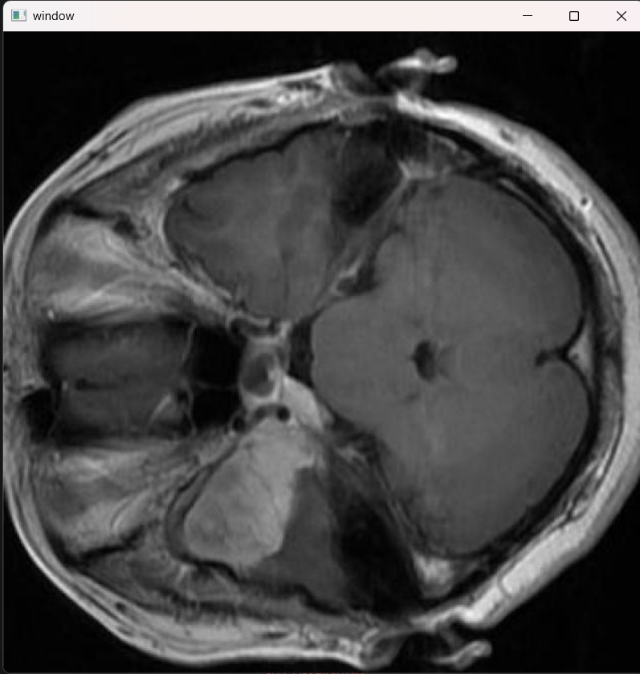
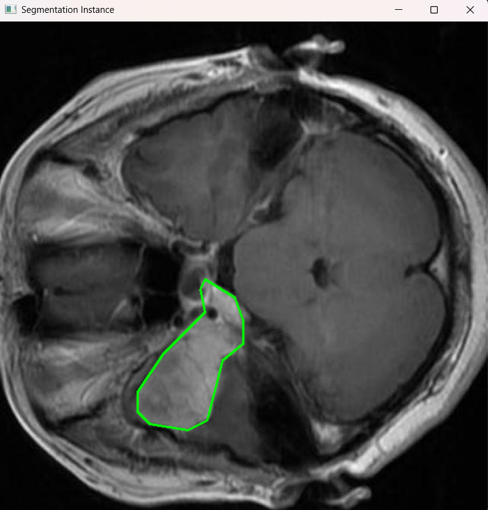

# Brain Tumor Detection with YOLOv11
_Brain tumor detection with Computer Vision YOLOv11 model. This model identifies a box that indicate tumor locations in MRI (Magnetic Resonance Imaging)._


On the first part, i did the read_img_label.py to load the images and show that with cv2 with polygon that indicate the tumor location.

## Dataset
The data comes ready to train, with yaml, the labels and images.

The dataset live in ```data/```, (I had to put it in a gitignore), I download this dataset in [kaggle](https://www.kaggle.com/datasets/pkdarabi/medical-image-dataset-brain-tumor-detection/data).

The dataset comes with train/DEV/valid split:
```
data/train -> /labels or /images
data/test -> /labels or /images
data/valid -> /labels or /images
```
In ```configs/``` you can find ```data.yaml``` 

## The run code of read_img_label.py

